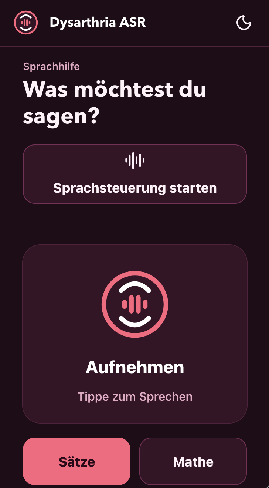
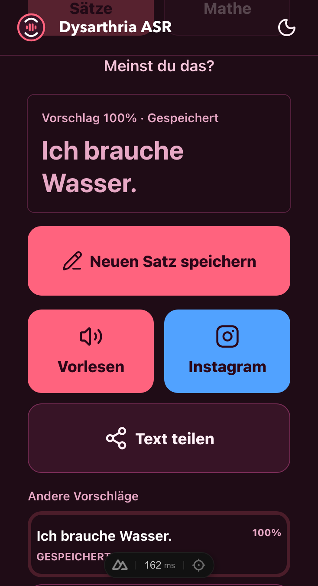

<p align="center">
  
</p>

# Dysarthria ASR

A German speech-assistance prototype for one person with dysarthria.

The app records short speech, creates text suggestions, and lets the user speak, copy, or share selected text. It also stores recordings and imported WhatsApp voice messages in a local corpus for review and later ASR training.

## Screenshots

| Record speech | Select and use a suggestion |
| --- | --- |
|  |  |

## What it does

- Records speech with push-to-talk and automatic stop after silence.
- Transcribes each recording with a configured `faster-whisper` model.
- Offers saved phrases, editable categories, and generated German phrase suggestions.
- Supports German spoken arithmetic and spoken emoji names, such as `weißes Herz emoji` → 🤍.
- Can speak text in the browser, copy it, or share it with the native share sheet. WhatsApp opens only as a fallback; the app never sends a message itself.
- Supports voice commands for recording, text actions, modes, suggestions, and categories.
- Runs as an installable PWA on iPhone.
- Stores audio, ASR drafts, corrected transcripts, and label state in SQLite.
- Imports audio files and WhatsApp chat-export ZIP files.
- Provides guided reading with short German Tatoeba prompts.
- Exports reviewed recordings and labels as training data.

## Requirements

- Python 3.14 or later
- [uv](https://docs.astral.sh/uv/)
- Node.js 24 or later
- pnpm 11

## Quick start

Use two terminals from the project root.

In the first terminal, install backend dependencies and start the API. `ASR_MODEL` is required. This example uses the public base model:

```sh
cd backend
uv sync
ASR_MODEL=mobiuslabsgmbh/faster-whisper-large-v3-turbo \
  uv run uvicorn src.app:app --reload
```

The API runs at <http://127.0.0.1:8000>. The first transcription downloads the configured Whisper model.

In the second terminal, install frontend dependencies and start the web app:

```sh
cd app
pnpm install
pnpm dev
```

Open <http://localhost:3000>.

The frontend sends `/api/*` requests to `NUXT_API_BASE`. Its default is `http://127.0.0.1:8000`. To use a different API URL:

```sh
cd app
NUXT_API_BASE=https://example.com pnpm dev
```

## Use the app

1. Start the API and web app.
2. Select a saved phrase or tap `Aufnehmen` and speak.
3. Wait for the silence stop, then select a suggestion if needed.
4. Use `Vorlesen`, copy the text, or share it.
5. Use `Lesetraining aufnehmen` to record one displayed reading prompt. You can play it back, retry, or save it.
6. Open `/labeling` to review recordings and prepare training data.

To manage phrases and categories, open `/phrases`.

## Labeling and training data

The `/labeling` page lists app recordings, guided-reading clips, and WhatsApp uploads. Filter by source, status, uncertain labels, or missing ASR text. You can correct a transcript, add a note, set a status (`labeled`, `draft`, or `skipped`), or delete a recording.

On `/whatsapp-import`, upload audio files or a WhatsApp export ZIP. For a ZIP, choose the speaker whose files you want to import. Files with no ASR text are skipped.

A recording is ready for training only when it has a corrected transcript, has status `labeled`, and is not marked `unsure`. Download the reviewed set from `/api/labeling/training-data.zip`. The ZIP contains audio files, `training-labels.csv`, and `README.txt`.

At startup, the backend downloads the German Tatoeba sentence export only when no local cache exists. Prompt IDs, source, category, and split are stable. The app uses the `train` split for normal training. It keeps the `validation` and `test` splits out of training and exports so they stay available for controlled evaluation.

The database survives restarts. Startup creates missing tables and seed data without deleting existing recordings or labels.

## Checks

Backend:

```sh
cd backend
uv run pytest
```

Frontend:

```sh
cd app
pnpm typecheck
pnpm test
```

## Privacy

Audio clips, transcripts, and labels are stored locally in `data/` by default. The backend downloads the configured ASR model from Hugging Face on first use, and downloads German Tatoeba prompts when no local prompt cache exists.

## License

This project is licensed under the [MIT License](LICENSE).

## Project layout

- `app/` — Nuxt frontend and PWA
- `backend/` — FastAPI API, ASR integration, SQLite storage, and legacy static UI
- `backend/seed/phrases.csv` — default phrase seed for containers
- `data/phrases.csv` — local phrase seed, when present
- `data/audio/` — saved audio clips; not committed
- `data/app.sqlite` — local SQLite database; not committed
